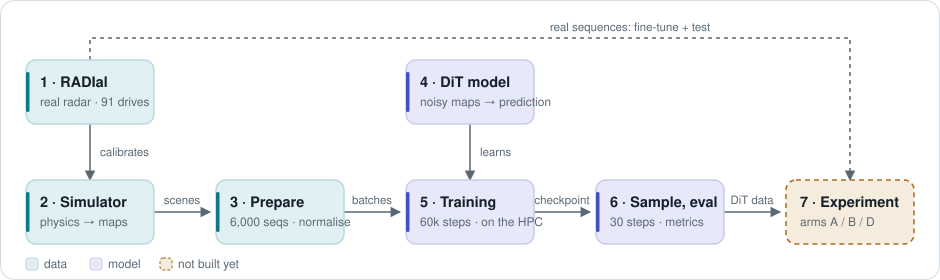

# radSeq · Level 0

A diffusion model (DiT) that generates sequences of radar Range-Doppler maps. The question: is a model pretrained on a simulator and fine-tuned on a little real data (RADIal) a better source of detector training data than the simulator itself?

Talk to the agent: type `/regain` in Claude Code.

---

### 1 · RADIal
Real recordings from a 77 GHz radar, read into dB Range-Doppler maps with vehicle labels. Right now RADIal only calibrates the simulator. Later it will be the real data for fine-tuning and testing.
[radial.py · read_labels](../src/radial.py#L21) · [power_map](../src/radial.py#L114) · [split.json](../data/radial/split.json)

### 2 · Simulator
Builds a road scene and renders 8 radar frames from physics. It has two variants: *engineer*, which was never tuned to RADIal, and *fitted*, which was calibrated to it.
[scene_sim.py · gen_sequence](../src/scene_sim.py#L321) · [radar_physics.py · RADIAL_SPEC](../src/radar_physics.py#L74) · [fit_scene_simulator.py](../scripts/fit_scene_simulator.py#L92)

### 3 · Prepare
Renders 6,000 sequences per simulator variant to disk and normalises them. Vehicle positions become condition maps.
[build_scene_cache.py · render_split](../scripts/build_scene_cache.py#L21) · [scene_data.py · SceneSequenceDataset](../src/scene_data.py#L43) · [trajectory_condition.py](../src/trajectory_condition.py#L51)

### 4 · DiT model
Cuts each frame into 16×16 patches. Each block runs attention over time, then attention over space. There are 12 blocks.
[dit.py · TemporalDiT](../src/dit.py#L135) · [FactorizedBlock](../src/dit.py#L64) · [patching.py](../src/patching.py#L17)

### 5 · Training
Adds noise to the maps and teaches the model to remove it: 60,000 steps per simulator variant, on the HPC. It was started on 21/9. Whether it finished is not known from here.
[train.py · train](../src/train.py#L192) · [diffusion.py](../src/diffusion.py#L40) · [pretrain_engineer.yaml](../configs/pretrain_engineer.yaml)

### 6 · Sample, eval
Generates sequences from pure noise in 30 steps and compares them with the simulator.
[sample.py](../src/sample.py#L134) · [eval/](../src/eval/metrics.py)

### 7 · Experiment · *not built*
Fine-tune on RADIal, then train a detector three ways: real data only (A), real + simulator data (B), real + DiT data (D). No code exists for this yet.
